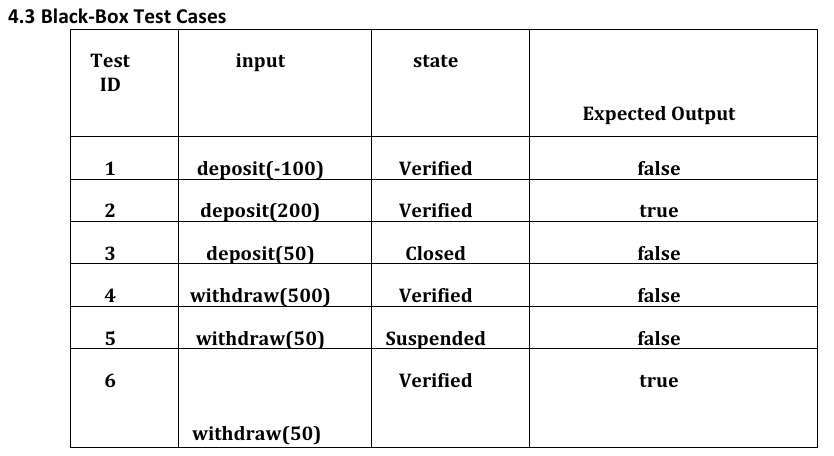
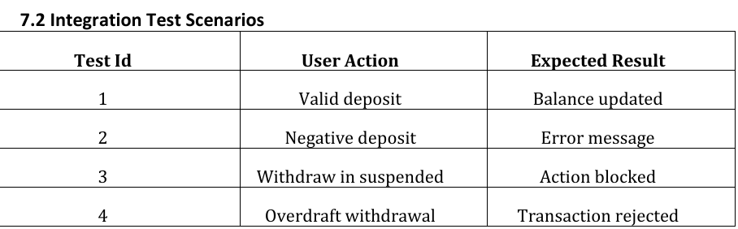
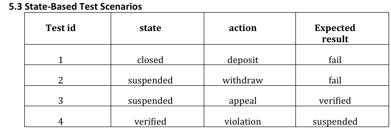
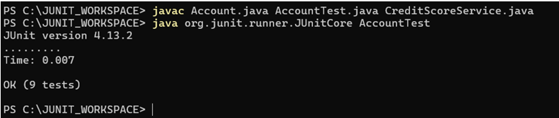

# 🏦 Banking System Testing Suite


This project demonstrates the application of multiple software testing techniques on a simplified banking system. It was developed as part of the Software Testing, Validation, and Verification course.

## 📌 Overview
The system under test includes:
- Client account management
- Deposit and withdrawal operations
- State-based account transitions (Verified, Suspended, Closed)
- GUI interaction simulation

The project focuses on validating system correctness and reliability using structured testing methodologies.

---

## 🧪 Testing Techniques Applied

### 🔹 Black-Box Testing
- Equivalence Partitioning
- Boundary Value Analysis
- Validation of valid/invalid inputs

### 🔹 White-Box Testing
- Control Flow Graphs (CFG)
- 100% Branch Coverage
- Unit testing using JUnit

### 🔹 State-Based Testing
- Account lifecycle validation
- State transition matrix
- Illegal action handling

### 🔹 UI Testing
- Input validation checks
- Button enable/disable behavior
- Status label correctness

### 🔹 Integration Testing
- Simulated flow: GUI → Controller → Service → Account
- Validation of system interaction

### 🔹 Test-Driven Development (TDD)
- Implemented feature: **Credit Score Eligibility**
- Followed Red → Green → Refactor cycle

---
## 📸 Screenshots

### ⚠️ Test Cases Example




### ✅ JUnit Test Execution


---

## 🛠️ Technologies Used
- Java
- JUnit 4
- Manual Testing Techniques
- Basic GUI Simulation (HTML / Mockups)

---


## ▶️ How to Run

1. Clone the repository:
```bash
git clone https://github.com/OmarAbouraia/banking-system-testing-suite.git
```

2. Open the project in IntelliJ or Eclipse

3. Run JUnit tests:
- Run `AccountTest.java`
- View test results and coverage

---
## 🧪 Sample Test Case

```java
@Test
public void testWithdraw_ValidAmount() {
    Account acc = new Account(100, "Verified");
    assertTrue(acc.withdraw(50));
}
```


## 📊 Key Achievements
- Achieved **100% branch coverage** for core methods
- Designed comprehensive test cases across multiple testing types
- Implemented TDD for new feature development
- Built structured test documentation and traceability matrix

---

## 🎯 Why This Project Matters

This project demonstrates my ability to:
- Design structured and comprehensive test cases
- Apply multiple testing methodologies in real scenarios
- Ensure software reliability through systematic validation
- Work with test automation tools like JUnit
- Think like a QA engineer and a developer simultaneously
  
---

## 🧠 Key Learnings

- Importance of combining multiple testing strategies
- How state-based systems affect application behavior
- Writing testable and maintainable code
- Applying Test-Driven Development (TDD) in practice
- Understanding edge cases and system limitations
---

👥 Team Members 
- Omar Ahmed Abou Raia
- Hossam Ossama Hussieny
- Mariam Ibrahim Assar
- Mariam Tarek Farouk
- Hassan Sherif
- Habiba El-Sabaa Ali

---
## 📄 Documentation
The full project report is available in:
```
/Testing_Report.pdf
```

---

## 🚀 Notes
- This project focuses on correctness and validation, not performance or security.
- Integration testing is simulated due to system constraints.
---

## 🌟 Support & Feedback

⭐ **Give it a Star** to support the project!
💡 **Have suggestions or found a bug?**  
- 🐛 Open an issue for bugs
- Or reach out directly using the links below
 

## 📬 Contact

<p align="center">

<a href="mailto:omara862005@gmail.com?subject=TinyTelemetry%20Feedback&body=Hi%20Eng.%20Omar%20Abouraia,%0A%0AI%20would%20like%20to%20share%20some%20feedback...">
  
</a>

<a href="https://www.linkedin.com/in/omarabouraia/">
  
</a>

<a href="https://github.com/OmarAbouraia">
  
</a>

</p>
